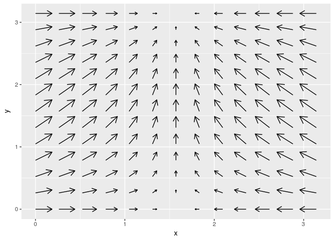

<!-- README.md is generated from README.Rmd. Please edit that file -->
[](https://travis-ci.org/mitchelloharawild/ggquiver) [](https://cran.r-project.org/package=ggquiver) [](https://cran.r-project.org/package=ggquiver)

ggquiver
========

Quiver plots for ggplot2.

Installation
------------

The development version of ggquiver can be installed from Github using:

``` r
# install.packages("devtools")
devtools::install_github("mitchelloharawild/ggquiver")
```

Usage
-----

**ggquiver** introduces a new geom `geom_quiver()`, which produces a quiver plot in *ggplot2*.

``` r
expand.grid(x=seq(0,pi,pi/12), y=seq(0,pi,pi/12)) %>%
  mutate(u = cos(x),
         v = sin(y)) %>%
  ggplot(aes(x=x,y=y,u=u,v=v)) +
  geom_quiver()
```


